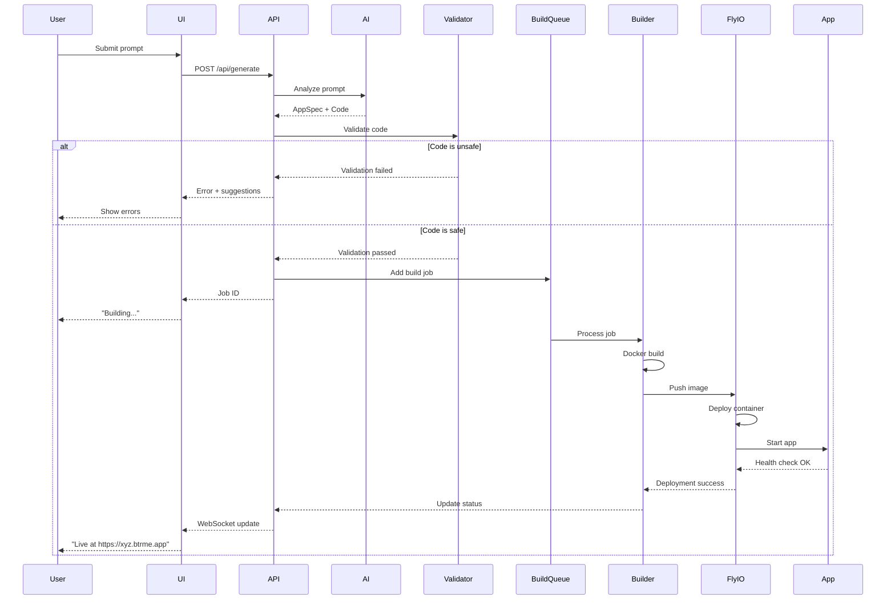

# NoCode AI Builder - Teknik Mimari Detayları

## 🏛️ System Architecture

```
┌─────────────────────────────────────────────────────────────────┐
│                         USER INTERFACE                           │
│                                                                   │
│  ┌────────────┐  ┌────────────┐  ┌────────────┐  ┌───────────┐ │
│  │   Landing  │  │  Builder   │  │ Dashboard  │  │  Preview  │ │
│  │    Page    │  │   (Chat)   │  │ (Projects) │  │  Window   │ │
│  └────────────┘  └────────────┘  └────────────┘  └───────────┘ │
│                                                                   │
│                    Next.js 14 App Router                         │
└───────────────────────────┬───────────────────────────────────────┘
                            │
                            │ REST API / tRPC
                            ↓
┌─────────────────────────────────────────────────────────────────┐
│                      APPLICATION LAYER                           │
│                                                                   │
│  ┌──────────────────────────────────────────────────────────┐  │
│  │                    API Gateway                            │  │
│  │              (Next.js API Routes / Express)               │  │
│  └──────────────────────────────────────────────────────────┘  │
│                                                                   │
│  ┌─────────────┐  ┌─────────────┐  ┌─────────────┐            │
│  │    Auth     │  │   Project   │  │    User     │            │
│  │   Service   │  │   Service   │  │   Service   │            │
│  └─────────────┘  └─────────────┘  └─────────────┘            │
│                                                                   │
└───────────────────────────┬───────────────────────────────────────┘
                            │
                            ↓
┌─────────────────────────────────────────────────────────────────┐
│                        AI PIPELINE                               │
│                                                                   │
│  ┌──────────────────────────────────────────────────────────┐  │
│  │  1. Prompt Analyzer                                       │  │
│  │     - Intent classification                               │  │
│  │     - Feature extraction                                  │  │
│  │     - Clarification needed?                               │  │
│  └──────────────────────────────────────────────────────────┘  │
│                            ↓                                     │
│  ┌──────────────────────────────────────────────────────────┐  │
│  │  2. Spec Generator                                        │  │
│  │     - AppSpec creation                                    │  │
│  │     - Template matching (Vector DB)                       │  │
│  │     - Architecture decisions                              │  │
│  └──────────────────────────────────────────────────────────┘  │
│                            ↓                                     │
│  ┌──────────────────────────────────────────────────────────┐  │
│  │  3. Code Generator                                        │  │
│  │     - Template selection                                  │  │
│  │     - AI-powered customization                            │  │
│  │     - File structure generation                           │  │
│  └──────────────────────────────────────────────────────────┘  │
│                            ↓                                     │
│  ┌──────────────────────────────────────────────────────────┐  │
│  │  4. Validator                                             │  │
│  │     - Security scan (OWASP)                               │  │
│  │     - Code quality (ESLint, TypeScript)                   │  │
│  │     - Dependency check                                    │  │
│  └──────────────────────────────────────────────────────────┘  │
│                                                                   │
│  Powered by: Claude 3.5 Sonnet API                              │
└───────────────────────────┬───────────────────────────────────────┘
                            │
                            ↓
┌─────────────────────────────────────────────────────────────────┐
│                    BUILD & DEPLOY PIPELINE                       │
│                                                                   │
│  ┌──────────────────────────────────────────────────────────┐  │
│  │  Build Queue (BullMQ + Redis)                            │  │
│  └──────────────────────────────────────────────────────────┘  │
│                            ↓                                     │
│  ┌──────────────────────────────────────────────────────────┐  │
│  │  Container Builder                                        │  │
│  │  - Docker build                                           │  │
│  │  - Image optimization                                     │  │
│  │  - Security hardening                                     │  │
│  └──────────────────────────────────────────────────────────┘  │
│                            ↓                                     │
│  ┌──────────────────────────────────────────────────────────┐  │
│  │  Registry (Docker Hub / Fly.io Registry)                 │  │
│  └──────────────────────────────────────────────────────────┘  │
│                            ↓                                     │
│  ┌──────────────────────────────────────────────────────────┐  │
│  │  Deployer (Fly.io API)                                   │  │
│  │  - Container deployment                                   │  │
│  │  - DNS configuration (*.btrme.app)                        │  │
│  │  - SSL certificate (automatic)                            │  │
│  │  - Health check & monitoring                              │  │
│  └──────────────────────────────────────────────────────────┘  │
└───────────────────────────┬───────────────────────────────────────┘
                            │
                            ↓
┌─────────────────────────────────────────────────────────────────┐
│                    GENERATED APPS RUNTIME                        │
│                                                                   │
│  ┌────────────┐  ┌────────────┐  ┌────────────┐  ┌──────────┐ │
│  │   App 1    │  │   App 2    │  │   App 3    │  │  App N   │ │
│  │ (Container)│  │ (Container)│  │ (Container)│  │(Container)│ │
│  │            │  │            │  │            │  │          │ │
│  │ Next.js    │  │ Next.js    │  │ Next.js    │  │ Next.js  │ │
│  │ + DB       │  │ + DB       │  │ + DB       │  │ + DB     │ │
│  └────────────┘  └────────────┘  └────────────┘  └──────────┘ │
│                                                                   │
│  Subdomain: https://[app-id].btrme.app                          │
│  Platform: Fly.io (auto-scaling)                                │
└─────────────────────────────────────────────────────────────────┘

                            ↕
┌─────────────────────────────────────────────────────────────────┐
│                       DATA LAYER                                 │
│                                                                   │
│  ┌──────────────┐  ┌──────────────┐  ┌──────────────┐          │
│  │  PostgreSQL  │  │    Redis     │  │  Vector DB   │          │
│  │   (Prisma)   │  │   (Cache)    │  │  (Pinecone)  │          │
│  │              │  │              │  │              │          │
│  │ - Users      │  │ - Sessions   │  │ - Templates  │          │
│  │ - Projects   │  │ - Job Queue  │  │ - Embeddings │          │
│  │ - Apps       │  │ - Rate Limit │  │              │          │
│  │ - Templates  │  │              │  │              │          │
│  └──────────────┘  └──────────────┘  └──────────────┘          │
│                                                                   │
│  ┌──────────────────────────────────────┐                       │
│  │   S3-Compatible Storage              │                       │
│  │   - User uploads                      │                       │
│  │   - Generated assets                  │                       │
│  │   - Build artifacts                   │                       │
│  └──────────────────────────────────────┘                       │
└─────────────────────────────────────────────────────────────────┘

                            ↕
┌─────────────────────────────────────────────────────────────────┐
│                  MONITORING & OBSERVABILITY                      │
│                                                                   │
│  ┌──────────────┐  ┌──────────────┐  ┌──────────────┐          │
│  │    Sentry    │  │ Better Stack │  │   Vercel     │          │
│  │   (Errors)   │  │    (Logs)    │  │  (Analytics) │          │
│  └──────────────┘  └──────────────┘  └──────────────┘          │
└─────────────────────────────────────────────────────────────────┘
```

---

## 🗄️ Database Schema

```prisma
// Platform Users & Projects
model User {
  id            String    @id @default(cuid())
  email         String    @unique
  name          String?
  image         String?
  createdAt     DateTime  @default(now())
  updatedAt     DateTime  @updatedAt

  projects      Project[]
  apiKeys       ApiKey[]

  @@map("users")
}

model Project {
  id            String    @id @default(cuid())
  name          String
  description   String?
  userId        String
  status        ProjectStatus @default(DRAFT)

  // Original prompt
  prompt        String    @db.Text
  conversation  Json?     // Conversation history

  // Generated spec
  appSpec       Json?

  // Generated code
  codeFiles     Json?     // File structure

  // Deployment info
  deploymentId  String?   @unique
  subdomain     String?   @unique
  liveUrl       String?

  createdAt     DateTime  @default(now())
  updatedAt     DateTime  @updatedAt

  user          User      @relation(fields: [userId], references: [id], onDelete: Cascade)
  deployments   Deployment[]
  versions      ProjectVersion[]

  @@map("projects")
  @@index([userId])
  @@index([subdomain])
}

enum ProjectStatus {
  DRAFT
  GENERATING
  GENERATED
  BUILDING
  DEPLOYING
  DEPLOYED
  FAILED
  ARCHIVED
}

model ProjectVersion {
  id            String    @id @default(cuid())
  projectId     String
  version       Int
  codeFiles     Json
  appSpec       Json?
  deploymentId  String?
  createdAt     DateTime  @default(now())

  project       Project   @relation(fields: [projectId], references: [id], onDelete: Cascade)

  @@unique([projectId, version])
  @@map("project_versions")
}

model Deployment {
  id            String    @id @default(cuid())
  projectId     String
  version       Int

  // Fly.io details
  flyAppId      String?   @unique
  flyAppName    String?
  flyRegion     String?

  // Status
  status        DeploymentStatus @default(PENDING)
  buildLog      String?   @db.Text
  errorLog      String?   @db.Text

  // Metadata
  imageSize     Int?      // bytes
  buildTime     Int?      // seconds

  createdAt     DateTime  @default(now())
  deployedAt    DateTime?

  project       Project   @relation(fields: [projectId], references: [id], onDelete: Cascade)

  @@map("deployments")
  @@index([projectId])
}

enum DeploymentStatus {
  PENDING
  BUILDING
  PUSHING
  DEPLOYING
  RUNNING
  FAILED
  STOPPED
}

model Template {
  id            String    @id @default(cuid())
  name          String    @unique
  displayName   String
  description   String
  category      String

  // Template files
  files         Json      // File structure

  // Matching
  keywords      String[]
  embedding     Json?     // Vector for similarity search

  // Metadata
  featured      Boolean   @default(false)
  usageCount    Int       @default(0)

  createdAt     DateTime  @default(now())
  updatedAt     DateTime  @updatedAt

  @@map("templates")
}

model ApiKey {
  id            String    @id @default(cuid())
  userId        String
  name          String
  key           String    @unique
  lastUsed      DateTime?
  createdAt     DateTime  @default(now())
  expiresAt     DateTime?

  user          User      @relation(fields: [userId], references: [id], onDelete: Cascade)

  @@map("api_keys")
  @@index([userId])
}

// Usage tracking for billing
model Usage {
  id            String    @id @default(cuid())
  userId        String
  resourceType  ResourceType
  amount        Int       // tokens, builds, deployments
  cost          Decimal?  @db.Decimal(10, 4)
  metadata      Json?
  createdAt     DateTime  @default(now())

  @@map("usage")
  @@index([userId, createdAt])
}

enum ResourceType {
  AI_TOKENS
  BUILD_MINUTES
  DEPLOYMENT
  STORAGE
}
```

---

## 🔐 Security Architecture

### **1. Input Validation**
```typescript
// Prompt sanitization
const sanitizePrompt = (prompt: string): string => {
  // Remove potential command injections
  const cleaned = prompt
    .replace(/[;`$()]/g, '')
    .trim();

  // Length limits
  if (cleaned.length > 5000) {
    throw new Error('Prompt too long');
  }

  return cleaned;
};
```

### **2. Code Validation Pipeline**
```typescript
interface ValidationResult {
  safe: boolean;
  issues: SecurityIssue[];
  score: number; // 0-100
}

const validators = [
  validateNoEval,          // No eval(), Function()
  validateNoFS,            // No filesystem access
  validateNoNetworkAccess, // No fetch to internal IPs
  validateDependencies,    // No malicious packages
  validateSQLInjection,    // Parameterized queries only
  validateXSS,             // Proper sanitization
];

const validateCode = async (code: string): Promise<ValidationResult> => {
  const results = await Promise.all(
    validators.map(v => v(code))
  );

  return aggregateResults(results);
};
```

### **3. Container Isolation**
```yaml
# fly.toml - Per generated app
app = "app-{unique-id}"

[build]
  dockerfile = "Dockerfile"

[env]
  NODE_ENV = "production"

[http_service]
  internal_port = 3000
  force_https = true
  auto_stop_machines = true
  auto_start_machines = true
  min_machines_running = 0

[[vm]]
  cpu_kind = "shared"
  cpus = 1
  memory_mb = 512

[compute]
  max_concurrency = 25

[http_service.concurrency]
  type = "requests"
  hard_limit = 250
  soft_limit = 200
```

### **4. Rate Limiting**
```typescript
// Redis-based rate limiting
const rateLimits = {
  promptGeneration: {
    points: 10,      // 10 prompts
    duration: 3600,  // per hour
  },
  deployment: {
    points: 5,       // 5 deployments
    duration: 3600,  // per hour
  },
  apiCalls: {
    points: 100,     // 100 requests
    duration: 60,    // per minute
  },
};
```

---

## 🚀 Deployment Flow (Detailed)



---

## 📦 Template Structure

```
/templates
  /base
    - package.json
    - next.config.js
    - tailwind.config.js
    - tsconfig.json

  /reminder-app
    /components
      - ReminderForm.tsx
      - ReminderList.tsx
      - NotificationButton.tsx
    /app
      /api
        - reminders.ts
        - notifications.ts
      - page.tsx
      - layout.tsx
    - template.config.json
    - README.md

  /dashboard-app
    /components
      - MetricCard.tsx
      - Chart.tsx
      - Filters.tsx
    /app
      /api
        - data.ts
      - page.tsx
    - template.config.json

  /form-builder
    /components
      - FormBuilder.tsx
      - FormPreview.tsx
      - FieldTypes.tsx
    /app
      /api
        - submissions.ts
      - page.tsx
    - template.config.json

  /crud-app
    /components
      - DataTable.tsx
      - CreateModal.tsx
      - EditForm.tsx
    /app
      /api
        - crud.ts
      - page.tsx
    - template.config.json

  /tracker-app
    /components
      - TrackerInput.tsx
      - ProgressChart.tsx
      - History.tsx
    /app
      /api
        - entries.ts
      - page.tsx
    - template.config.json
```

### **Template Config Example**
```json
{
  "id": "reminder-app",
  "name": "Reminder App",
  "description": "Simple reminder and notification app",
  "category": "productivity",
  "keywords": ["reminder", "notification", "alert", "schedule", "daily"],
  "features": [
    "daily_notifications",
    "custom_reminders",
    "snooze",
    "history"
  ],
  "variables": {
    "appName": "My Reminder App",
    "reminderType": "daily",
    "notificationTime": "09:00"
  },
  "dependencies": {
    "@vercel/analytics": "^1.0.0",
    "date-fns": "^2.30.0",
    "zustand": "^4.4.0"
  },
  "aiCustomization": {
    "enabled": true,
    "customizableComponents": [
      "ReminderForm",
      "NotificationButton"
    ],
    "customizableFeatures": [
      "notification_message",
      "reminder_frequency",
      "ui_theme"
    ]
  }
}
```

---

## 🧪 AI Prompt Engineering

### **System Prompt (for Code Generation)**
```
You are an expert full-stack developer specializing in Next.js, React, and TypeScript.

Your task is to generate production-ready code for web applications based on user requirements.

CONSTRAINTS:
- Only use Next.js 14 App Router
- TypeScript strict mode
- Tailwind CSS for styling
- No external API calls to unverified domains
- No filesystem access (fs module)
- No eval() or Function() constructor
- All database queries must be parameterized
- All user inputs must be sanitized

OUTPUT FORMAT:
Return a JSON object with this structure:
{
  "files": [
    {
      "path": "app/page.tsx",
      "content": "..."
    }
  ],
  "dependencies": {
    "package-name": "version"
  },
  "environment": {
    "VARIABLE_NAME": "description"
  }
}

SECURITY:
- Never include sensitive data
- Always validate inputs
- Use HTTPS for external requests
- Implement CSRF protection
```

### **Prompt Flow Example**
```typescript
const generateApp = async (userPrompt: string) => {
  // Step 1: Analyze intent
  const analysis = await claude.messages.create({
    model: 'claude-3-5-sonnet-20241022',
    max_tokens: 1024,
    messages: [{
      role: 'user',
      content: `Analyze this app request and identify:
      1. App type (reminder, dashboard, form, etc.)
      2. Key features
      3. Data model
      4. UI requirements

      Request: "${userPrompt}"

      Respond in JSON.`
    }]
  });

  // Step 2: Match to template
  const template = await findBestTemplate(analysis);

  // Step 3: Generate customizations
  const code = await claude.messages.create({
    model: 'claude-3-5-sonnet-20241022',
    max_tokens: 4096,
    messages: [{
      role: 'user',
      content: `Using template "${template.name}", customize it for:
      ${JSON.stringify(analysis)}

      Generate complete code following the system constraints.`
    }]
  });

  return code;
};
```

---

## 🔧 Development Environment Setup

```bash
# Prerequisites
node --version  # v20+
docker --version
fly version

# Clone & Install
git clone <repo>
cd btrme
npm install

# Environment variables
cp .env.example .env
# Edit .env with:
# - ANTHROPIC_API_KEY
# - DATABASE_URL
# - REDIS_URL
# - FLY_API_TOKEN

# Database setup
npx prisma migrate dev
npx prisma generate

# Run development
npm run dev

# Run with Docker
docker-compose up
```

---

## 📈 Scaling Strategy

### **Phase 1: MVP (0-1000 users)**
- Single Vercel instance
- Fly.io shared VMs
- Managed PostgreSQL
- Upstash Redis

### **Phase 2: Growth (1K-10K users)**
- CDN for static assets
- Database read replicas
- Redis cluster
- Auto-scaling Fly.io machines

### **Phase 3: Scale (10K+ users)**
- Multi-region deployment
- Kubernetes for generated apps
- Dedicated infrastructure
- Custom ML models (fine-tuned)

---

**Last Updated:** 2025-11-13
**Version:** 1.0
